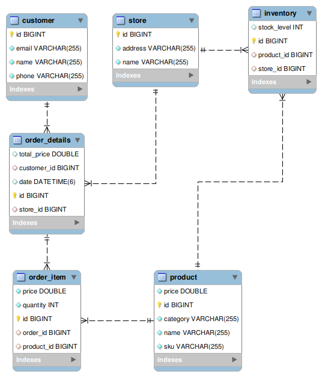
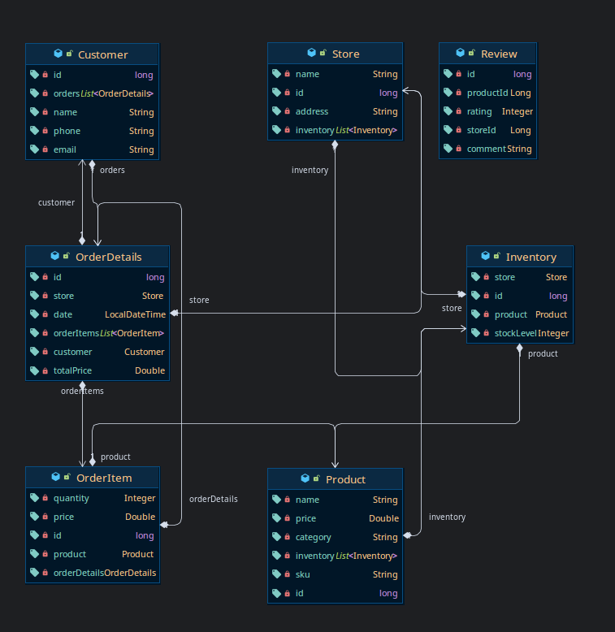
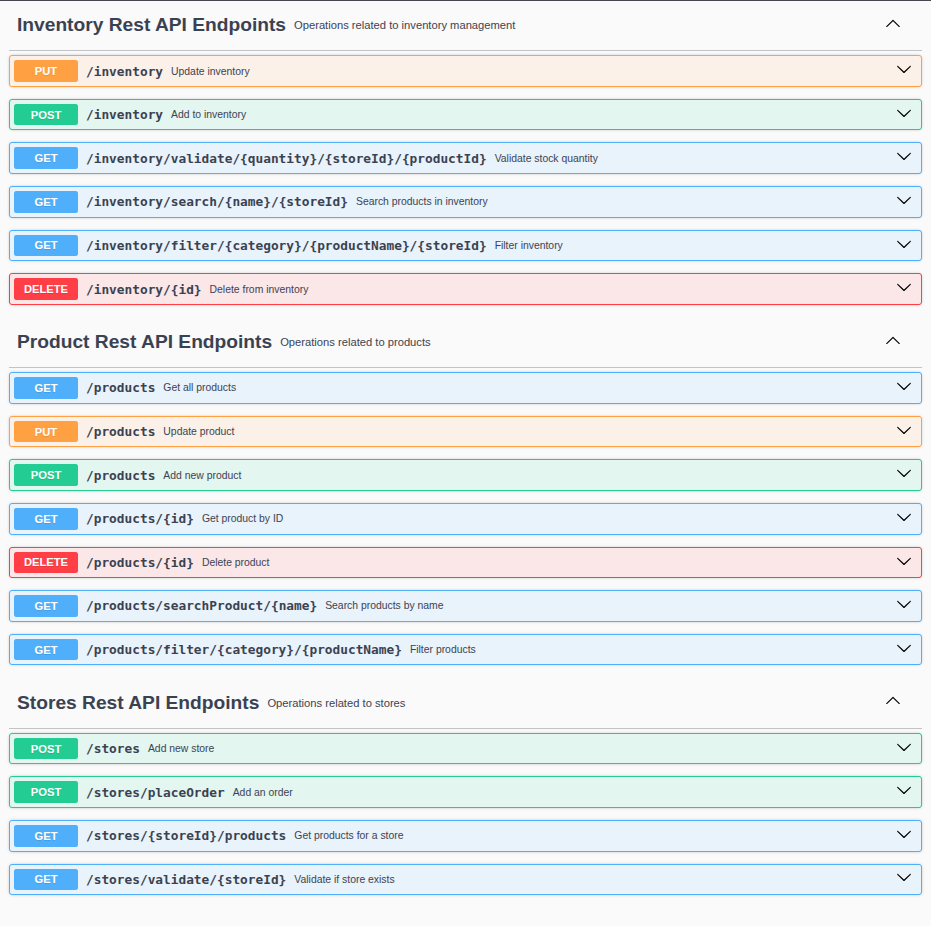

# Inventory Management System

A full-stack inventory management application that enables users to manage stores, products, inventory, and process orders efficiently.

## 📋 Table of Contents

- [Introduction](#introduction)
- [Technology Stack](#technology-stack)
- [Project Structure](#project-structure)
- [Database ERD](#database-erd)
- [POJO ERD](#pojo-erd)
- [API Endpoints](#api-endpoints)
- [Getting Started](#getting-started)
- [Features](#features)

## 1. Introduction

This Inventory Management System is designed to streamline inventory operations across multiple stores. It provides a comprehensive solution for:
- Managing multiple stores and their inventory
- Handling product catalog and categorization
- Processing customer orders
- Tracking inventory levels and stock availability
- Managing customer reviews

The system consists of a **Spring Boot backend** and a **HTML/CSS/JavaScript frontend**, communicating through RESTful APIs.

## 2. Technology Stack

### Backend
- **Framework**: Spring Boot 3.5.8
- **Java Version**: 21
- **Build Tool**: Maven
- **Database**: 
  - MySQL for relational data
  - MongoDB for document storage (reviews)
- **Dependencies**:
  - Spring Data JPA/Hibernate
  - Spring Data MongoDB
  - Spring Web
  - Spring Validation
  - Spring Actuator
  - Lombok
  - SpringDoc OpenAPI (Swagger)

### Frontend
- **HTML5**
- **CSS3**
- **JavaScript (Vanilla)**
- **Bootstrap 5.3.3**

## 3. Project Structure

```
inventory-managment/
├── back-end/                          # Spring Boot Backend
│   ├── pom.xml                       # Maven configuration
│   └── src/main/
│       ├── java/com/project/code/
│       │   ├── controller/           # REST Controllers
│       │   ├── service/              # Business Logic
│       │   ├── repository/           # Data Access Layer
│       │   ├── domain/               # Entity & DTO classes
│       │   │   ├── entity/
│       │   │   └── dto/
│       │   ├── exception/            # Custom Exceptions
│       │   ├── config/               # Application Configuration
│       │   └── CodeApplication.java  # Main Application Class
│       └── resources/
│           ├── application.properties
│           ├── application-dev.properties
│           └── database/
├── front-end/                        # HTML/CSS/JS Frontend
│   ├── index.html                    # Main Dashboard
│   ├── script.js                     # JavaScript Logic
│   ├── frontend.css                  # Styling
│   ├── add-product.html              # Add Product Page
│   ├── edit-product.html             # Edit Product Page
│   ├── reviews.html                  # Reviews Page
│   └── images/                       # Assets
└── media/                            # Documentation Images
```

## 4. Database ERD



## 5. POJO ERD


## 6. API Endpoints
